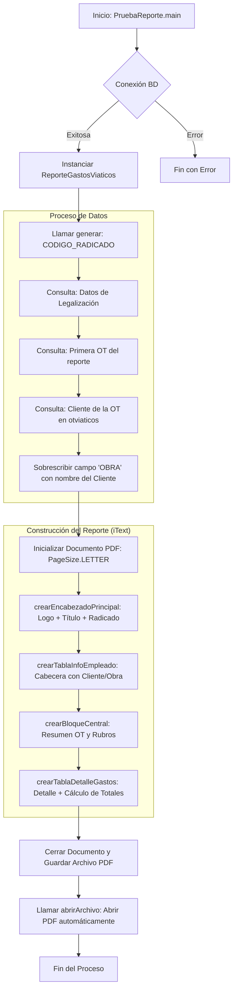

# Documentación del Sistema de Reportes de Viáticos

Esta documentación explica el flujo de trabajo y la arquitectura del sistema implementado para la generación del **Reporte de Gastos de Viáticos**.

## Arquitectura del Sistema

El sistema se basa en una arquitectura de capas diseñada para ser escalable y profesional:


### Capas de Software
- **Capa de Datos**: Gestionada por `ConexionDatos.java`, provee el acceso a PostgreSQL.
- **Capa Base (Skins)**: `BaseInforme.java` centraliza el diseño corporativo (Azul Navy, Gris F2F2F2).
- **Capa de Negocio**: `ReporteGastosViaticos.java` transforma filas de DB en celdas de PDF.

## Flujo de Generación del Reporte

A continuación se muestra el proceso desde que se solicita un reporte hasta que se abre el archivo PDF final:



## Componentes Clave

| Archivo | Responsabilidad |
| :--- | :--- |
| `BaseInforme.java` | Define colores (`AZUL_NAVY`, `GRIS_CLARO`) y métodos de celdas. |
| `ReporteGastosViaticos.java` | Lógica principal, consultas SQL complejas y diseño del layout. |
| `PruebaReporte.java` | Punto de entrada para pruebas y desarrollo. |
| `itext-2.1.7.jar` | Librería core para la creación de archivos PDF. |

## Cómo Compilar y Ejecutar

Para compilar el sistema completo:
```powershell
javac -cp ".;itext-2.1.7.jar;postgresql-42.7.1.jar" *.java
```

Para generar un reporte de prueba:
```powershell
java -cp ".;itext-2.1.7.jar;postgresql-42.7.1.jar" PruebaReporte
```
